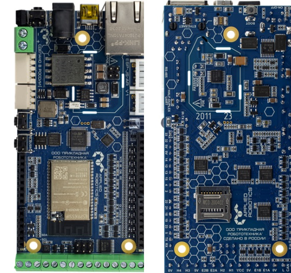
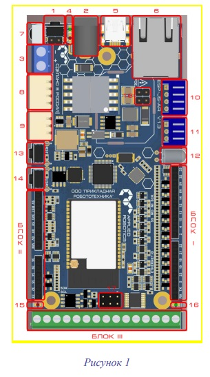
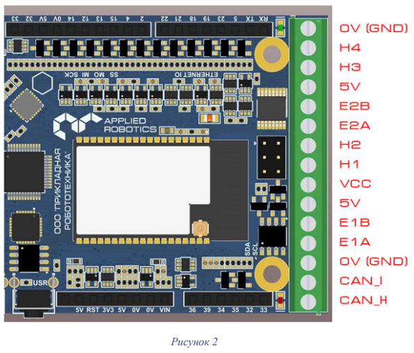
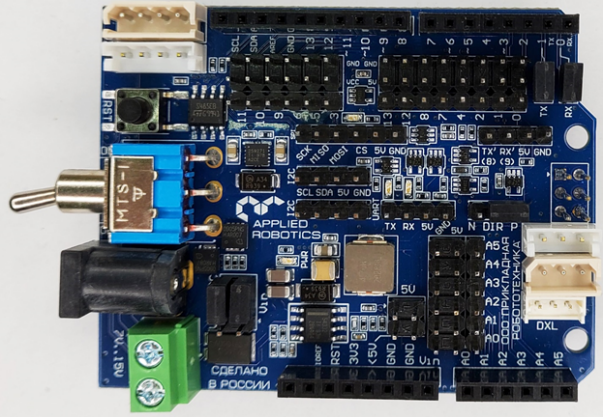
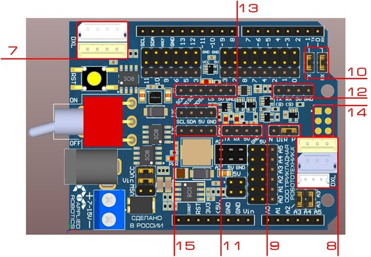
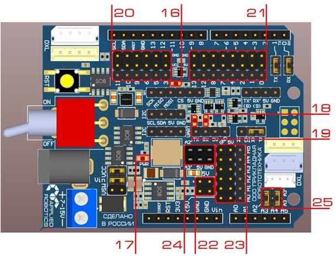
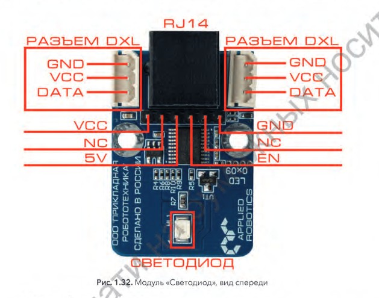
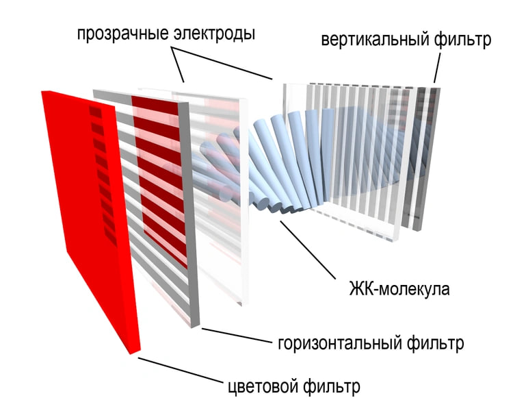
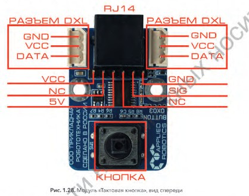

Подробный обзор конструкции блока
---------------------------------

На данный момент мы переходим к тематике подробного описания блока. Блок – отдельная часть конструкции умной Agrolab GH, содержащая ``управляющие элементы``, ``информационную панель`` и ``датчик температуры``. 

Геометрические характеристики   
~~~~~~~~~~~~~~~~~~~~~~~~~~~~~
Блок размещается над корпусом Agrolab GH, между дверцами. 
::
  Ширина: 180 мм
  Длина: 340 мм
  Высота: 155 мм
Блок выполнен из панелей матового оргстекла толщиной 5 мм с технологическими отверстиями, соединённых металлическими уголками. 

Микроконтроллер
~~~~~~~~~~~~~~~

 
На проекте «Agrolab_GH» используется плата ``ESP-JS-AR``.

Помимо возможности подключения различных периферийных модулей контроллер ESP-JS-AR обладает возможностью подключения и управления исполнительными механизмами – двигателями постоянного тока и сервоприводами. Для этого на его борту располагается 2 блока клемников для подключения классических двигателей постоянного тока. 

Так же предусмотрена возможность подключения как квадратурных (до 2х штук), так и инкрементных (до 4х штук) энкодеров. Кроме обычных двигателей постоянного тока контроллер может управлять двигателями по интерфейсу CAN. Из специфических интерфейсов контроллер обладает интерфейсами ``RS485`` и 3х пиновым полудуплексным UART, что позволяет подключать к контроллеру Dynamixel-совместимые модули – как сенсорные, так и сервоприводы. В зависимости от модификации используется либо 3х, либо 4х пиновые разъемы MOLEX или JST.

Для беспроводного обмена данными на контроллере имеются как классические интерфейсы – WiFi и Bluetooth, реализованные в центральном модуле контроллера – ESP32 WROVER’е, так и модули для приема и передачи данных в ИК-диапазоне на частоте в 38 Кгц Питание контроллера может быть осуществлено следующими способами: от 5В через miniUSB разъем. Однако в данном случае часть функционала контроллера будет недоступна (из за ограниченности отдачи тока по шине USB). Более того, в ряде случае контроллер от питания через USB вообще не будет функционировать. 

Поэтому совместно с подключением по USB рекомендуется использовать дополнительное внешнее питание - От Ethernet разъема, используя технологию POE. 

Расположение значимых элементов изображено на схеме 

Здесь:

1. ``ON-OFF_BUT`` - Кнопка включения\выключения контроллера

2. ``PWR_IN`` – Разъем для подключения внешнего силового питания

3. ``BAT`` – Клеменик для подключения внешнего силового питания. По своей сути аналогичен с разъемом PWR_IN. Внимание! При подключении питания соблюдайте полярность!

4. ``Индикаторы питания``. Красный – 5В, зеленый – 12В

5. ``USB`` – Порт типа miniUSB для программирования контроллера

6. ``ETHERNET`` – Разъем для подключения к проводной сети Ethernet. Поддерживает POE

7. ``IR_RX`` – Приемник сигнала в ИК диапазоне на частоте 38кГц

8. ``RS485`` – 4х пиновый разъем типа Molex для подключения совместимых периферийных устройств

9. ``HALH-DUPLEX UART`` – 3х пиновый разъем типа Molex для подключения совместимых периферийных устройств

10. ``RS485`` – 4х пиновый разъем типа JST для подключения совместимых периферийных устройств

11. ``HALH-DUPLEX UART`` – 3х пиновый разъем типа JST для подключения совместимых периферийных устройств

12. ``IR_TX`` – Передатчик сигнала в ИК диапазоне

13. ``RST_BUT`` – Кнопка перезагрузки контроллера

14. ``USR_BUT`` – Пользовательская программируемая кнопка

15. ``EXPANDER_LED`` – Программируемый индикационный светодиод расширителя портов ввода-вывода

16. ``ESP_LED`` – Программируемый индикационный светодиод модуля ESP32 WROVER

17. ``Аналог ISP интерфейса`` для совместимости контроллера с подключаемыми Arduino-шилдами. По факту содержит в себе интерфейс SPI, продублированный с боковых гребенок, 5В, GND и RST

18. ``PAS_POE`` – штыри для подключения джамперов в случае использования Passive POE. Джамперы устанавливаются по прямоугольникам, изображенным на плате. 

Блок №III содержит в себе клеммные соединители, рассчитанные для подключения и управления внешними исполнительными механизмами – двигателями постоянного тока. Расположение контактов в блоке приведено на Рисунке:

Плата расширения
~~~~~~~~~~~~~~~~

В состав набора помимо основного контроллера ESP-JS-AR входит плата расширения для подключения периферийных модулей. Цель этой платы – упростить процесс подключения различных внешних модулей к основному контроллеру за счет большого количество организованных стандартным образом выводов. 

Помимо классического расширения портов для подключения внешних устройств плата так же обладает реализацией Dynamixel-интерфейса как в 1-wire TTL исполнении, так и в RS485. 

**Интерфейсы**

Для обеспечения удобства подключения на плате продублированы все популярные интерфейсы, а так же снабжены дополнительными линиями питания. Таким образом для подключения к интерфейсам I2C, SPI и UART больше не требуется разделенными проводами подключаться к разным местам платы. Так же на плату выведен интерфейс для подключения Dynamixel-совместимых устройств и данный интерфейс так же продублирован всеми популярными типами разъемов – Molex 3pin, Molex 4pin, Molex mini, JST 3pin, JST 4pin.

Здесь:

7.	``Блок 4х проводных разъемов интерфейса RS484``, используемого для подключения Dynamixel-совместимых устройств, использующих 4х пиновую схему подключения. 

8.	``Блок 3х проводных разъемов интерфейса 1-wire TTL``, используемого для подключения Dynamixel-совместимых устройств, использующих 3х пиновую схему подключения. 

9.	``Джампер DIR`` служит для выбора полярности пина, управляющего Dynamixel-линией. 

10.	``Джамперы``, замыкающие линии UART. При установленных джамперах линии UART расходятся по плате и реализуют Dynamixel-интерфейс. 

11.	``4х пиновый блок`` подключения к интерфейсу UART. Данный UART является замультиплексированным к основному UART платы, таким образом его можно использовать параллельно с Dynamixel-интерфейсом. 

12.	``Колодка для вывода программного UART``. TX – 8 цифровая линия, RX – 9 цифровая линия.

13.	``Колодка для подключения к SPI интерфейсу``

14.	``Проходной ISP интерфейс``. Содержит в себе SPI. Не является аналогом колодки в зависимости от типа основной платы SPI от основной платы будет выводиться либо на колодку 13, либо на колодку 14.

**Прочий функционал**

Помимо системы питания и наличия различных интерфейсов на плате расширения располагается еще ряд	функциональных блоков, изображенных на Рисунке:

Здесь:

15.	``Программируемый светодиод``, по умолчанию управляется цифровой линией 13.
16.	``Индикационный светодиод`` наличия питания 5В.
17.	``Индикационный светодиод`` линии RX интерфейса UART.
18.	``Индикационный светодиод`` линии TX интерфейса UART.
19.	``Блок цифровых линий``, совмещенных с питанием VCC. Может быть использован для удобного подключения 3х пиновых периферийных модулей, требующих силовое питания, например, сервоприводов. Не рекомендуется подключать сюда Arduino-совместимые датчики.
20.	``Блок цифровых линий``, совмещенных с питанием 5В. Может быть использован для подключения цифровых датчиков.
21.	``Блок линий 5В``. Может быть использован для взятия питания 5В (нижние 2 штыря – с основной платы, верхние 2 штыря – с платы расширения), либо для установки джамперов и передачи питания 5В с платы расширения на основную плату (см. схемы организации питания).

Электронные функциональные модули
~~~~~~~~~~~~~~~~~~~~~~~~~~~~~~~~~

Блок содержит несколько модулей (датчиков, плат, ключей, кнопок, дисплеев, светодиодов) соединённых проводами и закреплённых на корпусе блока. 

Список модулей:
~~~~~~~~~~~~~~~

**Светодиод**

.. |pic7| image:: images/5.png
   :width: 45%

|pic7| |pic8|

Модуль “Светодиод” имеет:

``Разъём DXL`` - два трёхпиновых разъёма типа Molex, содержащих в себе линии GND (земля), VCC (питание), DATA (линия данных). Используются для подключения модуля по интерфейсу Dynamixel, как в одиночном виде, так и в составе цепи устройств.

``Разъём типа RJ14`` для подключения модуля в фирменную плату расширения для подключения сенсорных модулей.

``Шестипиновый разъём``, содержащий следующие линии:

``VCC``- линия питания, на которую можно подать напряжение в диапазоне от 5В до 12В;

``NC`` - неиспользуемая линия;

``5V`` - линия питания, на которую можно подать напряжение 3.3В или 5В. При подаче напряжения питание 3.3В необходимо следить, чтобы на линиях VCC отсутствовало напряжение;

``EN`` - сигнальная линия;

``NC`` - неиспользуемая линия;

``GND`` - линия земли;

``Светодиод`` - одноцветный источник излучения.

**Датчик влажности**

Модуль ``Датчик влажности воздуха и температуры`` построен на базе сенсора DHT11, способного определять температуру и влажность окружающей среды в области около нормальных климатических условий (при температуре от 0 до 50 градусов и влажности от 20 до 90%).

.. figure:: images/5.png
       :width: 50%
       :align: center
       :alt: Датчик влажности воздуха и температуры

**LCD-дисплей**

LCD (``жидкокристаллический дисплей``) - это технология отображения, которая использует свойства жидких кристаллов для управления прохождением света через материал. Теория LCD была разработана в середине 1960-х гг., а первые использования были применены к переносным калькуляторам в 1970-х гг.

Устройство LCD состоит из ``двух слоев стекла``, между которыми находится слой жидких кристаллов, способных изменять свою поляризацию при воздействии электрического поля. Эти свойства жидких кристаллов используются для управления прохождением света через материал и создания изображения.

Каждый элемент пикселя на экране состоит из трех основных цветов - красного, зеленого и синего. Элементы пикселей управляются транзисторами, которые открываются и закрываются в зависимости от введенного сигнала, что позволяет изменять поляризацию кристаллов и управлять прохождением света через каждый пиксель.

В результате создается изображение на экране, которое может быть установлено на множество устройств, включая компьютерные мониторы, телевизоры, мобильные телефоны и другие устройства. LCD дисплеи имеют множество преимуществ, включая низкое потребление ``энергии``, ``легкость`` и ``тонкость``, высокую яркость и контрастность, а также широкие углы обзора.

**Описание**

- Снабжён отключаемой светодиодной подсветкой. Существует несколько вариантов, например синий фон белые буквы, зелёный фон чёрные буквы, чёрный фон белые буквы и проч. В наборе идёт с зелёным фоном и чёрными буквами.

- Сам по себе требует для подключения 6 цифровых пинов, но выпускают переходник на шину I2C на базе PCF8574, что сильно упрощает подключение и экономит пины. В наборе идёт дисплей с припаянным переходником.

- На переходнике также распаян потенциометр настройки контрастности (синий параллелепипед с под крестовую отвёртку). В зависимости от напряжения питания нужно вручную подстроить контрастность. Например при питании платы от USB на пин 5V приходит ~4.7V, а при внешнем питании от адаптера – 5.0V. Контрастность символов на дисплее будет разной.

- Переходник может иметь разный адрес для указания в программе: 0х26, 0x27 или 0x3F.

**В данном блоке используется четырёхсегментный LED-дисплей**

.. figure:: images/10.png
       :width: 60%
       :align: center
       :alt: дисплей

**Тактовые кнопки (5 штук)**

Модуль ``Тактовая кнопка``, по своей сути, является обычной тактовой кнопкой, размещенной на плате с микроконтроллером, Данный модуль предполагается использовать для более удобного подключения кнопок к популярным микроконтроллерам.
Внешний вид представлен на изображении LED-дисплея под дисплеем.

Кроме того, в конструкции предусмотрены ``релейные модули`` и ``модули силового ключа`` (4 штуки) для управления напряжением на управляющей плате.

.. raw:: html

    

        <iframe src="https://www.youtube.com/embed/hVOpKovRBRg?si=tlFsygnYlC2N3uZ0" frameborder="0" allowfullscreen style="position: absolute; top: 0; left: 0; width: 100%; height: 100%;"></iframe>
    

.. raw:: html

    

        <iframe src="https://www.youtube.com/embed/F-Opvw2Yygg?si=-oimBNRvmoCoGUOt" frameborder="0" allowfullscreen style="position: absolute; top: 0; left: 0; width: 100%; height: 100%;"></iframe>
    

