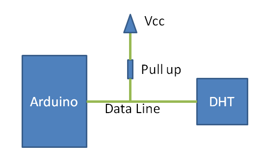
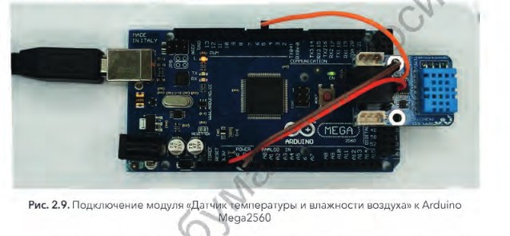
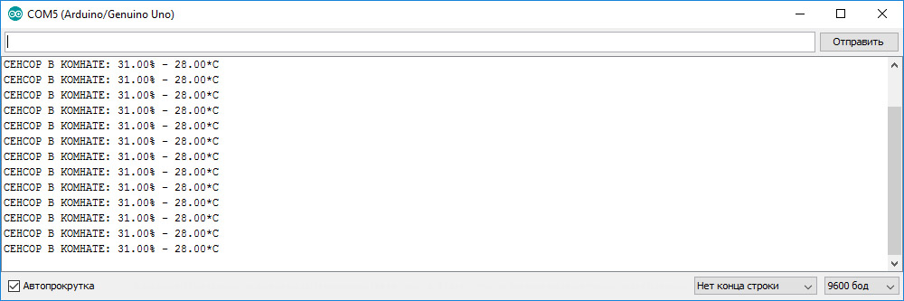

Программирование модуля датчик температуры и влажности
------------------------------------------------------

Характеристика датчика 
~~~~~~~~~~~~~~~~~~~~~~

- Напряжение питания и I/O: от 3,3 до 5,5 В;

- Тип датчика влажности: резистивный;

- Диапазон измерения влажности: от 20% до 90%;

- Погрешность при измерении влажности: 5%;

- Тип датчика температуры: NTC термистор;

- Диапазон измерения температуры: от 0°C до 50°C;

- Погрешность при измерении температуры: 2%;

- Частота опроса: не более 1 Гц (1 раз в сек.);

- Время отклика при измерении влажности: 10 с.

Процесс передачи данных от датчика DHT11 к Arduino
~~~~~~~~~~~~~~~~~~~~~~~~~~~~~~~~~~~~~~~~~~~~~~~~~~

Вначале плата Arduino подает на датчик DHT11 сигнал перепада с высокого уровня на низкий с задержкой 18 мкс чтобы запустить датчик DHT11 в работу. Затем Arduino pull-up (подтягивает ее к Vcc как показано на рисунке) линию передачи данных ждет 20-40 мкс ответа от датчика DHT11. Как только датчик DHT11 обнаруживает сигнал, запускающий его в работу (сигнал старта), он передает ответ в виде сигнала низкого уровня длительностью около 80 мкс. А затем контроллер DHT датчика pull up линию передачи данных и удерживает ее в этом состоянии около 80 мкс пока DHT модуль готовится к передаче данных.

Как только на линии передачи данных появилось напряжение низкого уровня это значит что датчик DHT11 передает ответный сигнал на Arduino. Как только этот процесс будет завершен, DHT снова "подтягивает" (pull-up) линию передачи данных на 80 мкс чтобы подготовиться к передаче данных.

Формат данных, передаваемых с DHT на Arduino, для каждого бита начинается с 50 мкс напряжения низкого уровня, а продолжительность напряжения высокого уровня после этого зависит от того какой бит передается - “0” или “1”.

Подключение модуля
~~~~~~~~~~~~~~~~~~  

Подключение модуля к ``Arduino Mega2560`` выполняется в соответствии с распиновкой разъёма. Таким образом, ``линию модуля 5В`` подключим к линии 5В Mega2560, лини. GND - к GND Mega2560, а ``линию управления SIG`` - к цифровой линии 5. В результате, внешний вид подключённого модуля будет выглядеть, как на рисунке:

Программирование
~~~~~~~~~~~~~~~~

Поскольку данный модуль имеет униикальный протокол обмена данными, подобный 1-Wire, для работы с ним рекомендуется использовать подходящую библиотеку. Таких библиотек существует достаточно много, но в данном примере воспользуемся библиотекой “iarduino_DHT”::

    #include <iarduino_DHT.h> // Подключаем библиотеку для работы с датчиком DHT
    iarduino_DHT sensor(5);   // Объявляем объект, указывая номер вывода, к которому подключён модуль
    void setup(){
    Serial.begin(9600);     // Инициируем передачу данных в монитор последовательного порта, на скорости 9600 бод
        delay(1000);            // Приостанавливаем выполнение скетча на 1 секунду, для перехода датчика в активное состояние
    }
    void loop(){                 Serial.print  ("CEHCOP B KOMHATE: ");
    switch(sensor.read()){  // Читаем показания датчика
        case DHT_OK:             Serial.println((String) sensor.hum + "% - " + sensor.tem + "*C"); break;
        case DHT_ERROR_CHECKSUM: Serial.println("HE PABEHCTBO KC");                                break;
        case DHT_ERROR_DATA:     Serial.println("OTBET HE COOTBETCTB. CEHCOPAM 'DHT'");            break;
        case DHT_ERROR_NO_REPLY: Serial.println("HET OTBETA");                                     break;
        default:                 Serial.println("ERROR");                                          break;
    } delay(8000);          // Приостанавливаем выполнение скетча на 8 секунд, между выводами показаний
    }

В результате, загрузив данный код в контроллер стандартным способом и открыв монитор порта, можно увидеть следующие данные:

