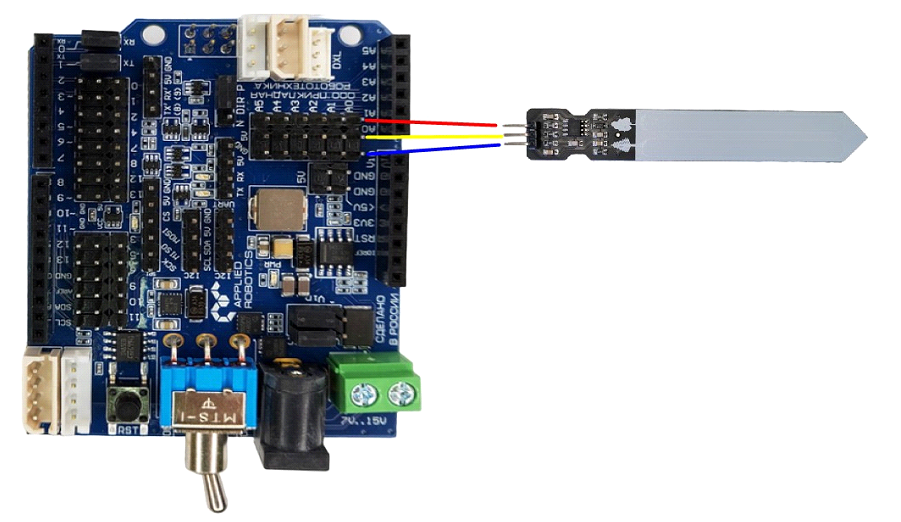
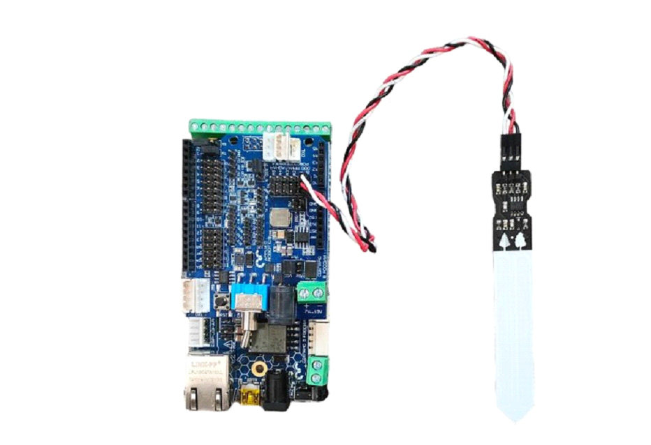

Программирование модуля датчик влажности почвы
----------------------------------------------

Характеристики 
~~~~~~~~~~~~~~

- Рабочее напряжение: 3,3 — 5 Вольт

- Ток потребления: 35 мА

- Выход: цифровой и аналоговый

- Размер модуля: 16×30 мм

- Размер щупа: 20×60 мм

Принцип работы
~~~~~~~~~~~~~~

Принцип работы датчика влажности почвы достаточно прост – он содержит ``2 зонда с оголенными контактами``, которые работают как резистор с переменным сопротивлением – их сопротивление изменяется в зависимости от уровня влаги в почве. Сопротивление данных зондов обратно пропорционально влажности почвы, то есть чем выше содержание влаги почвы, тем лучше ее проводимость и тем меньше ее сопротивление. Низкий уровень влаги в почве свидетельствует о ее плохой проводимости и, следовательно, ее большом сопротивлении. Датчик обеспечивает на своем выходе уровень аналогового напряжения, пропорциональный сопротивлению почвы.

Подключение
~~~~~~~~~~~

Используя провода ``«Папа — Мама»``, подключаем  напрямую к контроллеру ``ESP-JSAR``.

Датчик влажности почвы является аналоговым датчиком и подключается через блок аналоговых устройств на плате расширения. На экран можно выводить показания считываемые датчиком. На рисунке 30 показано подключение в живую.

|pic1| |pic2|

Программирование
~~~~~~~~~~~~~~~~

::

  #include <JsAr.h>               // Подключение библиотеки для работы с платой ESP.

  void setup() {
    JsAr.begin();                 // Начинаем работу с платой ESP. Без этой строчки ничего работать не будет!
    pinMode(A0, INPUT);           // Устанавливаем пин A0 как вход.
    Serial.begin(115200);         // Начинаем общение по сериал-порту.
  }

  void loop() {
    int tempData = analogRead(A0);                  // Считываем аналоговый сигнал.
    int intData = map(tempData, 0, 2048, 0, 100);   // Преобразовываем сигнал из некоторых условных единиц в проценты.
    String stringData = String(intData);            // Преобразовываем данные в строку.
    Serial.println(stringData);                     // Выводим в сериал-порт.
    delay(100);
  }

.. raw:: html

    

        <iframe src="https://www.youtube.com/embed/qodLbbpzOUQ?si=qh850r_JwWDjxG3w" frameborder="0" allowfullscreen style="position: absolute; top: 0; left: 0; width: 100%; height: 100%;"></iframe>
    

