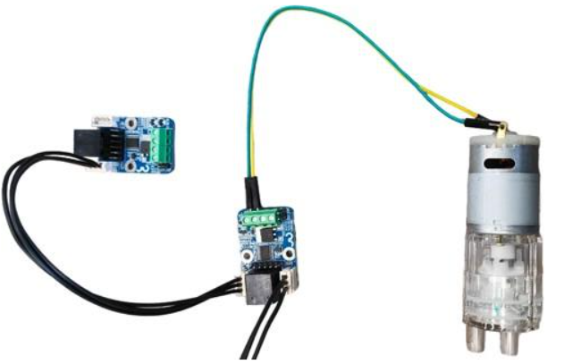

Программирование помпы
----------------------

Общие сведения
~~~~~~~~~~~~~~

Многофункциональный универсальный насос R385 относится к разновидности диафрагменных (мембранных) объёмных насосов. Его механизм представляет совокупность пропускных мембран в сочетании с пластиковым поршневым механизмом, установленным на ось двигателя. Ось смещена от центра под небольшим углом, заставляя поршни при вращении мотора поочерёдно втягиваться и возвращаться в исходное положение. Таким образом, в насосе одновременно создаются всасывающая и выталкивающая силы.

Сферы применения:
~~~~~~~~~~~~~~~~~

Аквариумистика, минифонтаны, декоративные дизайнерские решения в оформлении интерьера и ландшафта, гидропоника, садоводство и цветоводство. А также бытовое, промышленное и медицинское оборудование.

Характеристики
~~~~~~~~~~~~~~

- Рабочее напряжение: 6 ... 12 В.

- Потребляемый ток: 200 ... 600 мА.

- Диаметр патрубков (внешний): 7 мм.

- Диаметр патрубков (внутренний): 3 мм.

- Расход при 12 В: 1.5-2 литра/минуту

- Температура жидкости: до 80°С

Подключение
~~~~~~~~~~~

Насос подключается точно так же как и вентиляторы для системы вентиляции, отличия только в программном коде. Так же насос может взаимодействовать с датчиком влажности почвы и с датчиком уровня воды. К примеру когда влажность почвы недостаточна, включается насос и насыщает почву водой. Или насос будет наполнять емкость водой, пока датчик уровня воды не тонет.

Программирование
~~~~~~~~~~~~~~~~

::

  #include <JsAr.h>	// Подключение библиотеки для работы с платой ESP. #include <DxlMaster.h>		// Подключение библиотеки для работы с DXL-устройствами.
  DynamixelDevice pump(0x0D);

  void setup() {
    JsAr.begin();	// Начинаем работу с платой ESP. Без этой строчки ничего работать не будет!
    DxlMaster.begin(57600);	// Начинаем работу с DXL-устройствами.
    pump.init();	// Инициализируем кнопку и силовой ключ. 
  } 

  void loop() {
    pump.write(28, 255);	// Непосредственное открытие ключа записью значения 255 в нужный регистр.
  }

.. raw:: html

    

        <iframe src="https://www.youtube.com/embed/1aEX3SMDy4M?si=RQ6X6XDD_H2qHvlT" frameborder="0" allowfullscreen style="position: absolute; top: 0; left: 0; width: 100%; height: 100%;"></iframe>
    

