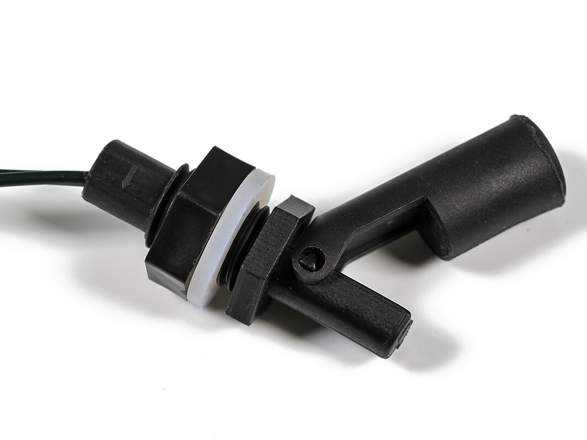
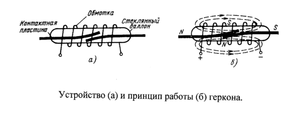
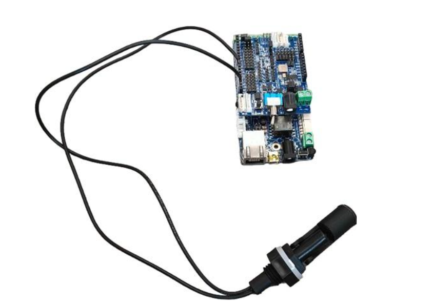

Программирование датчика уровня воды
------------------------------------

       
Характеристики
~~~~~~~~~~~~~~

- Максимальная нагрузка: 10 Вт

- Максимальное напряжение переключения: DC 100 В

- Максимальный ток переключения: 0.5 А

- Подключение: двухпроводное, длина кабеля - 40 см

       
Принцип работы поплавка
~~~~~~~~~~~~~~~~~~~~~~~

Поплавковый датчик уровня воды с ``магнитом и герконом`` основан на изменении магнитного поля, вызванного перемещением поплавка по мере изменения уровня жидкости. 

Магнит прикрепляется к поплавку, а геркон (герметичный контакт, чувствительный к магнитному полю) устанавливается в фиксированной точке внутри датчика. Когда уровень воды поднимается, поплавок поднимается вместе с ним, приближая магнит к геркону. Магнитное поле от магнита ``активирует геркон``, вызывая замыкание контактов.

Когда уровень воды снижается, поплавок опускается, удаляя магнит от геркона. Это приводит к размыканию контактов геркона. Таким образом, изменение состояния контактов геркона можно использовать для определения уровня воды.

Подключение
~~~~~~~~~~~

Схема подключения поплавка изображена на фото.

Программирование
~~~~~~~~~~~~~~~~

::

  #include <JsAr.h>	// Подключение библиотеки для работы с платой ESP.
  #define floatSensor 4	// Объявление пина, к которому подключен поплавок.

  void setup() {
    JsAr.begin();	// Начало работы с платой ESP.
    pinMode(floatSensor, INPUT_PULLUP);	// Настраиваем пин поплавка как вход.
    Serial.begin(115200);	// Начало общения по сериал порту.
  }

  void loop() {
    if (!digitalRead(floatSensor)) {	// Считываем данные с пина. Если на пине логический 0, то цепь разомкнута,
      Serial.println("CEHCOP TOHET");	// а значит, сенсор тонет.
    }
  }

.. raw:: html

    

        <iframe src="https://www.youtube.com/embed/gak22053QVM?si=OJhaU-WXFjT9ByXE" frameborder="0" allowfullscreen style="position: absolute; top: 0; left: 0; width: 100%; height: 100%;"></iframe>
    

