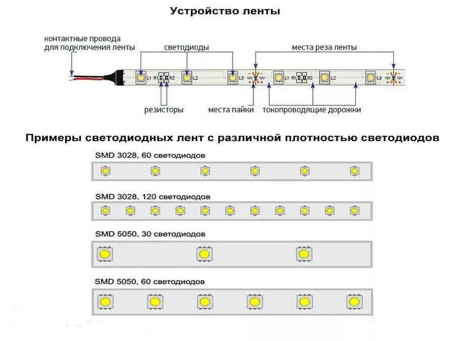

Программирование светодиодной ленты
-----------------------------------

Общие сведения
~~~~~~~~~~~~~~

Светодиодная лента - это гибкий электронный прибор, который состоит из множества светодиодов (Light Emitting Diodes, LED), уложенных на гибкой подложке. Светодиоды на ленте производят свет, который видим для глаза, когда они подключены к источнику питания.

Каждый светодиод на ленте состоит из полупроводниковых материалов, которые имеют разные типы примесей и отличаются свойствами. Внутри светодиода есть PN-переход - граница между двумя разными типами полупроводниковых материалов. Когда к светодиоду подается электрический ток, под влиянием поля, созданного в PN-переходе, электроны в полупроводнике переходят на более низкий уровень энергии и испускают фотоны света. Цвет света зависит от типа полупроводниковых материалов и примесей внутри светодиода.

Когда электрический ток проходит через светодиоды на светодиодной ленте, каждый светодиод генерирует свой индивидуальный поток света, который соединяется, чтобы создать яркие и равномерные источники света. Цвет и яркость света светодиодов на ленте может контролироваться с помощью соответствующих электронных схем, которые регулируют ток и напряжение на каждом светодиоде.

Подключение светодиодной ленты
~~~~~~~~~~~~~~~~~~~~~~~~~~~~~~

Подключение происходит также как и с остальными модулями,  подключаемыми в ``силовой ключ DXL``: красный провод к 5V, черный к GND.

Программирование
~~~~~~~~~~~~~~~~

::

  #include <JsAr.h>	// Подключение библиотеки для работы с платой ESP. #include <DxlMaster.h>		// Подключение библиотеки для работы с DXL-устройствами.
  DynamixelDevice ledstrip(0x0C);

  void setup() {
    JsAr.begin();	// Начинаем работу с платой ESP. Без этой строчки ничего работать не будет!
    DxlMaster.begin(57600);	// Начинаем работу с DXL-устройствами.
    ledstrip.init();	// Инициализируем кнопку и силовой ключ. 
  } 

  void loop() {
    ledstrip.write(28, 255);	// Непосредственное открытие ключа записью значения 255 в нужный регистр.
  }

.. raw:: html

    

        <iframe src="https://www.youtube.com/embed/mHMOCFUrL_M?si=_dYoZKopfhuo1zhK" frameborder="0" allowfullscreen style="position: absolute; top: 0; left: 0; width: 100%; height: 100%;"></iframe>
    

