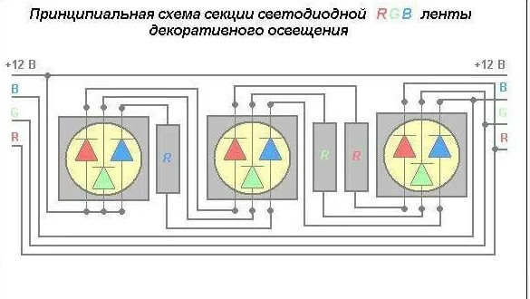
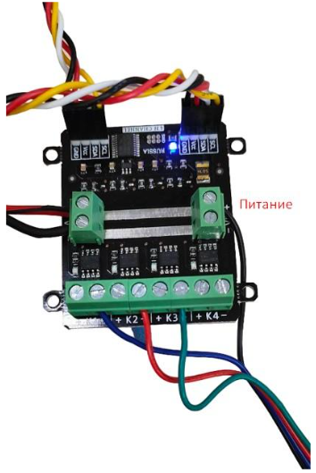
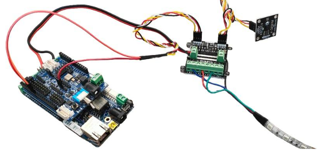

Программирование RGB ленты
--------------------------

Общие сведения
~~~~~~~~~~~~~~

RGB светодиодные ленты устроены аналогично одноцветным лентам и RGB светодиодам: в 12 Вольтовой ленте светодиоды каждого цвета соединяются по три штуки с токоограничивающим резистором и образуют сегмент ленты, далее эти сегменты подключаются параллельно.    

Также лента имеет общий вывод со всех цветов, в большинстве случаев это общий анод.

Подключение
~~~~~~~~~~~

Подключение RGB-ленты к модулю силовых ключей происходит не так как обычная светодиодная лента. У RGB-ленты три цветовых канала “Красный”, “Зеленый”, “Синий”, следовательно подключение должно быть по трем разным каналам.

|pic3| |pic4|

Программирование
~~~~~~~~~~~~~~~~

::

  #include <JsAr.h>	// Подключение библиотеки для работы с платой ESP. 
  #include <iarduino_I2C_Relay.h>	// Подключение библиотеки для работы с I2C силовым ключом.

  iarduino_I2C_Relay fets1(0x09);	// Создаем объект для работы с силовым ключом.
  void setup() {
    JsAr.begin();	// Начинаем работу с платой ESP.
    fets1.begin();	// Инициализируем силовой ключ.
    Serial.begin(115200);
  }

  void loop() {
    if (Serial.available()) {	// В случае, если в буфере что-то есть, то заходим в условие.
      char a = Serial.read();	// Считываем один символ из буфера.
      switch(a) { // Здесь массив вариантов включения и выключения необходимых цветов в зависимости от символа.
        case '1': fets1.digitalWrite(1, HIGH); 
          break;
        case 'q': fets1.digitalWrite(1, LOW); 
          break; 
        case '2': fets1.digitalWrite(2, HIGH); 
          break; 
        case 'w': fets1.digitalWrite(2, LOW); 
          break; 
        case '3': fets1.digitalWrite(3, HIGH); 
          break; 
        case 'e': fets1.digitalWrite(3, LOW); 
          break; 
        default:
          fets1.digitalWrite(1, LOW); // Если пришел символ, который мы не ожидаем, выключаем все.
          fets1.digitalWrite(2, LOW); 
          fets1.digitalWrite(3, LOW); 
          break;
      } 
    }
  }

