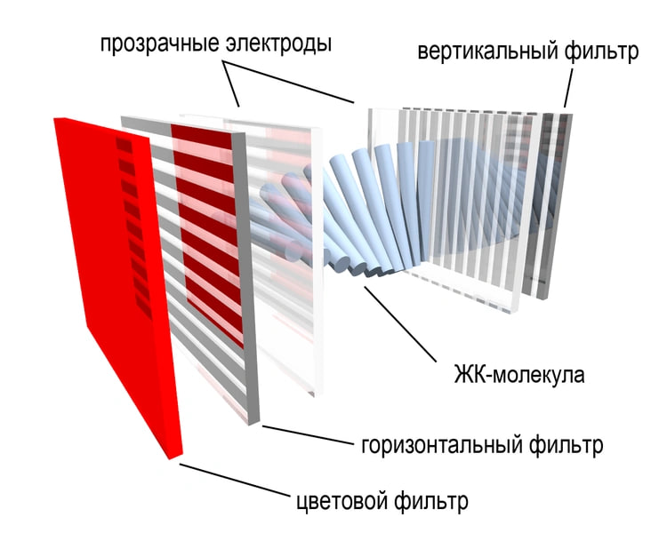
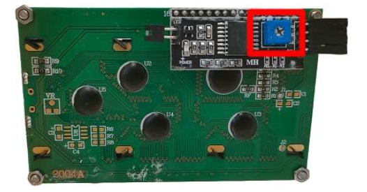
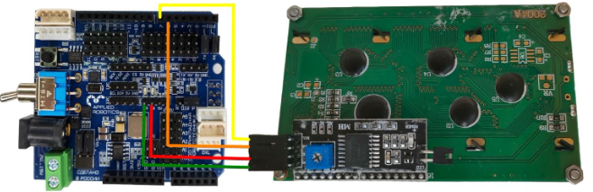

Написание интерфейса на дисплее и управление с кнопок
-----------------------------------------------------

История 
~~~~~~~

LCD (``жидкокристаллический дисплей``) - это технология отображения, которая использует свойства жидких кристаллов для управления прохождением света через материал. Теория LCD была разработана в середине 1960-х гг., а первые использования были применены к переносным калькуляторам в 1970-х гг.

Устройство LCD состоит из ``двух слоев стекла``, между которыми находится слой жидких кристаллов, способных изменять свою поляризацию при воздействии электрического поля. Эти свойства жидких кристаллов используются для управления прохождением света через материал и создания изображения.

Каждый элемент пикселя на экране состоит из трех основных цветов - красного, зеленого и синего. Элементы пикселей управляются транзисторами, которые открываются и закрываются в зависимости от введенного сигнала, что позволяет изменять поляризацию кристаллов и управлять прохождением света через каждый пиксель.

В результате создается изображение на экране, которое может быть установлено на множество устройств, включая компьютерные мониторы, телевизоры, мобильные телефоны и другие устройства. LCD дисплеи имеют множество преимуществ, включая низкое потребление ``энергии``, ``легкость`` и ``тонкость``, высокую яркость и контрастность, а также широкие углы обзора.

.. raw:: html

    

        <iframe src="https://www.youtube.com/embed/inY9uT0dr4A?si=kmTX0vw-D8ZBxXXr" frameborder="0" allowfullscreen style="position: absolute; top: 0; left: 0; width: 100%; height: 100%;"></iframe>
    

Описание
~~~~~~~~

- Снабжён отключаемой светодиодной подсветкой. Существует несколько вариантов, например синий фон белые буквы, зелёный фон чёрные буквы, чёрный фон белые буквы и проч. В наборе идёт с зелёным фоном и чёрными буквами.

- Сам по себе требует для подключения 6 цифровых пинов, но выпускают переходник на шину I2C на базе PCF8574, что сильно упрощает подключение и экономит пины. В наборе идёт дисплей с припаянным переходником.

- На переходнике также распаян потенциометр настройки контрастности (синий параллелепипед с под крестовую отвёртку). В зависимости от напряжения питания нужно вручную подстроить контрастность. Например при питании платы от USB на пин 5V приходит ~4.7V, а при внешнем питании от адаптера – 5.0V. Контрастность символов на дисплее будет разной.

- Переходник может иметь разный адрес для указания в программе: 0х26, 0x27 или 0x3F.

**В данном блоке используется четырёхсегментный LED-дисплей**

Подключение
~~~~~~~~~~~

Подключение дисплея продемонстрировано в ниже. 

Кнопки соединяются последовательно по протоколу DXL. У каждой имеется свой айди, который можно определить через библиотеку ``DynamixelDevice`` со встроенным примером ``Console``.

Программирование интерфейса
~~~~~~~~~~~~~~~~~~~~~~~~~~~

Интерфейс агролаба, выводимый на жидкокристаллический дисплей будет представлять собой меню, каждая строка в котором описывает либо название операции, либо название подменю. Переход между пунктами меню и выбор определенного пункта меню будет осуществляться с помощью кнопок dxl. Для начала реализуем функции инициализации кнопок и чтения нажатия с них. Функция ``init_buttons`` инициализирует dxl кнопки из массива ids и проверяет возможность получения данных с них. Если копка не была инициализирована – функция вернет id кнопки, к которой не удалось подключиться, если все кнопки были проверены успешно –вернется -1. Функция ``read_buttons`` считывает нажатие со всех кнопок и возвращает id кнопки, которая была нажата или -1, если ни одна из кнопок не нажата. В функции реализован программный антидребезг контактов. Далее создадим функцию инициализации дисплея. Функция проверяет, подключен ли дисплей и если она его находит – происходит инициализация дисплея, включение подсветки и вывод на 500 мс первоначальной заставки – слова Агролаб. 

Далее требуется создать класс menu, который будет описывать содержимое и поведение меню или подменю. Каждое подменю также будет являться объектом класса menu. 

Приватными членами класса будут: 

- Массив строк ``menu_items``, содержащий все пункты данного меню или подменю.

- ``selected_item`` – номер выбранного пользователем пункта меню.

- ``num_items`` – количество пунктов в меню.

- Массив ``actions`` – массив указателей на функции, каждая из которых будет вызываться при нажатии на определенный пункт меню.

- Булева переменная ``active`` – показывающая следует ли выводить это меню на экран в данный момент времени (активно ли оно). 

Публичными методами класса будут: 

- Конструктор класса – он задает стартовые параметры приватным членам.

- Метод ``bind_action`` – он привязывает функцию, написанную пользователем к пункту меню, при нажатии на который она должна вызываться. Такой механизм позволяет любому пункту меню задать любое действие, которое запрограммировал пользователь. 

- Методы ``menu_up`` и ``menu_down``, отвечающие за перемещение на один пункт вверх или вниз, при нажатии соответствующей кнопки.

- Метод ``menu_push``, позволяющий при нажатии кнопки вызвать требуемую функцию, которая раньше была привязана к пункту меню методом bind_action. 

- Метод ``draw_menu`` – он выводит все пункты меню на экран. 

- Методы ``set_actve`` и ``unset_active`` переключают меню из активного состояния в неактивное и наоборот, исходя из этого состояния меню, оно или выводится на экран функцией draw_menu, или нет. 

- Метод ``get_active`` возвращает состояние меню. 

Для создания объекта класса menu требуется создать массив, содержащий названия пунктов меню и вызвать конструктор класса с этим массивом и количеством пунктов меню в качестве аргументов. Таким же образом можно создать и подменю. Далее создаются пользовательские функции, которые будут вызываться при нажатии на каждый пункт меню. Для реализации перехода из главного меню в подменю и обратно нужны функции, которые будут задавать главному меню статус неактивно и активировать подменю при переходе в него. При обратном переходе требуется деактивировать подменю по нажатию кнопки и активировать основное меню. 

Далее идет функция ``setup`` в теле которой вызываются функции инициализации всех компонентов и привязка написанных выше пользовательских функций к конкретным пунктам меню. 

В функции ``loop`` вызывается отрисовка всех созданных ранее меню и подменю, но на экране будет выведено только активное. Затем происходит проверка, какая кнопка была нажата и при нажатии одной из кнопок происходит проверка, какое меню или подменю активно в данный момент и вызывается соответствующая функция для данного меню. Функция loop повторяется циклично, пока на контроллере есть питание.

  :: 
    
    #include <JsAr.h>   // Подключение библиотеки для работы с платой ESP.
    #include <DxlMaster2.h>       // Подключение библиотеки для работы с DXL-устройствами.
    #include <Wire.h>                     // Подключение библиотеки для работы с I2C устройствами.
    #include <LiquidCrystal_I2C.h>        // Подключение библиотеки для работы с LCD-дисплеем.

    #define NUM_BTNS 5

    uint8_t ids[NUM_BTNS] = {0x01,0x02,0x03,0x04,0x05};
    DynamixelDevice* btnDxl = (DynamixelDevice*)malloc(sizeof(DynamixelDevice) * NUM_BTNS);

    LiquidCrystal_I2C lcd(0x27, 16, 4);

    int init_buttons()
    {
      for(int i=0;i<NUM_BTNS;i++)
      {
        btnDxl[i] = DynamixelDevice(ids[i]);
        btnDxl[i].init();
        if (btnDxl[i].ping() != DYN_STATUS_OK)
          return ids[i];
      }
      return -1;
      
    }

    int read_buttons()
    {
      uint8_t btn;                                       // Переменные, необходимые для работы с кнопкой.

      for(int i=0;i<NUM_BTNS;i++)
      {
        btnDxl[i].read((uint8_t)27, (uint8_t)1, &btn); // Считывание регистра "нажатия" с кнопки.
        if (btn == 1)
        {
          delay(10);
          btnDxl[i].read((uint8_t)27, (uint8_t)1, &btn); // Считывание регистра "нажатия" с кнопки.
          if (btn ==1)
            return i;
        }
      }
      return -1;
    }

    int init_lcd()
    {
      byte count = 0;
      
      Wire.begin();
      for (byte i = 1; i < 120; i++)
      {
        Wire.beginTransmission (i);
        if (Wire.endTransmission () == 0)
          {
            if(i == 0x27)
            {
              count++;
              Serial.println("DISPLAY FOUND!");
              break;
            }
          delay (1);  
          } 
      } 

      if (count == 0)
        return 1;
        
      lcd.init();                                           // Инициализируем дисплей.
      lcd.backlight();                                      // Включаем подсветку
      lcd.setCursor(4.5, 1);                                // Устанавливаем курсор в середину 2 строки
      lcd.print("AGROLAB");                                 // Выводим текст
      delay(500);
      lcd.clear();  
      return -1;
    }

    typedef void(*Action)(); 

    class menu{
      private:
        String * menu_items;
        int selected_item;
        uint8_t num_items;
        Action   *actions;
        bool active; 
      public:
        menu(uint8_t n, String * items)
        {
          num_items = n - 1;
          menu_items = new String[n];
          actions = new Action[n];
          selected_item = 0;
          for(int i = 0; i<n;i++)
          {
            menu_items[i] = items[i];
            actions[i] = NULL;
          }
          active = false;
        }
        
        void bind_action(uint8_t n, Action act)
        {
          actions[n] = act;
        }
        
        void menu_down()
        {
          selected_item++;
          if (selected_item> num_items)
            selected_item = 0;
        }
        
        void menu_up()
        {
          selected_item--;
          if (selected_item < 0 )
            selected_item = num_items;
        }
        
        void menu_push()
        {
          if(actions[selected_item] == NULL)
            Serial.println("ACTION IS NOT BINDED TO THIS MENU ITEM");
          else
            actions[selected_item]();  
        }
        
        void draw_menu()
        { 
          if (active)
          { 
            lcd.clear();
            lcd.setCursor(0, selected_item % 4);
            lcd.print(char(126));                          
            int page_end = (selected_item / 4)*4 + 4 > num_items ? num_items % 4+1: 4;
            for(int i = 0; i<page_end; i++)  
            {                       
            lcd.setCursor(1, i);
            lcd.print(menu_items[(selected_item / 4)*4+i]);
            }
          }        
        }

        void set_active()
        {
          active = true;
        }
        
        void unset_active()
        {
          active = false;
        }
        
        bool get_active()
        {
          return active;
        }
    };

    #define MENU_MAIN_ITEMS 3
    String main_items[MENU_MAIN_ITEMS] = { "Controls", "Settings", "Calibration" };
    menu menu_main(MENU_MAIN_ITEMS, main_items);

    #define MENU_SUB_CONTROLS 5
    String controls_items[MENU_SUB_CONTROLS] = { "Web Set", "Airing Set", "LED Set", "Watering", "Back" };
    menu menu_controls(MENU_SUB_CONTROLS, controls_items);

    #define MENU_SUB_AIRING 4
    String airing_items[MENU_SUB_AIRING] = { "Time", "Humidity", "Button", "Back" };
    menu menu_airing(MENU_SUB_AIRING, airing_items);

    void enter_controls() {
      menu_main.unset_active();
      menu_controls.set_active();
    }
    void enter_settings() {
      Serial.println("Settings unavailable");
    }
    void enter_calibration() {
      Serial.println("Calibration unavailable");
    }
    void enter_airing() {
      menu_controls.unset_active();
      menu_airing.set_active();
    }

    void enter_web() {
      Serial.println("Web settings unavailable");
    }
    void enter_led() {
      Serial.println("LED settings unavailable");
    }
    void enter_watering() {
      Serial.println("Watering settings unavailable");
    }
    void back_main() {
      menu_main.set_active();
      menu_controls.unset_active();
    }

    void airing_time() {
      Serial.println("Airing is set to on time");
    }
    void airing_hum() {
      Serial.println("Airing is set to on humidity");
    }
    void airing_but() {
      Serial.println("Airing is set to on button");
    }
    void airing_back() {
      menu_controls.set_active();
      menu_airing.unset_active();
    }

    void setup() {
      JsAr.begin();            // Начинаем работу с платой ESP. Без этой строчки ничего работать не будет!
      DxlMaster.begin(57600);  // Начинаем работу с DXL-устройствами.
      Serial.begin(115200);

      Serial.println(String("ONBOARD VOLTAGE:") + JsAr.readVoltage());

      int status = init_buttons();
      if (status != -1) {
        Serial.println("BTN WITH ID " + String(ids[status]) + " NOT INITIALISED! Aborting.");
        ESP.restart();
      }

      status = init_lcd();
      if (status != -1) {
        Serial.println("LCD NOT INITIALISED! Aborting.");
        ESP.restart();
      }

      menu_main.bind_action(0, enter_controls);
      menu_main.bind_action(1, enter_settings);
      menu_main.bind_action(2, enter_calibration);
      menu_main.set_active();

      menu_controls.bind_action(0, enter_web);
      menu_controls.bind_action(1, enter_airing);
      menu_controls.bind_action(2, enter_led);
      menu_controls.bind_action(3, enter_watering);
      menu_controls.bind_action(4, back_main);

      menu_airing.bind_action(0, airing_time);
      menu_airing.bind_action(1, airing_hum);
      menu_airing.bind_action(2, airing_but);
      menu_airing.bind_action(3, airing_back);
    }

    void loop() {
      delay(100);
        Serial.println(menu_main.get_active());
          Serial.println(menu_controls.get_active());
            Serial.println(menu_airing.get_active());
            Serial.println("---------------------------");
      menu_main.draw_menu();
      menu_controls.draw_menu();
      menu_airing.draw_menu();
      
      switch (read_buttons()) {
        case 0:
          if(menu_main.get_active())
          {
            menu_main.menu_down();
          }else
          if(menu_controls.get_active())
          {
            menu_controls.menu_down();
          }else
          if(menu_airing.get_active())
          {
            menu_airing.menu_down();
          }
          break;
        case 1:
          if(menu_main.get_active())
          {
            menu_main.menu_up();
          }else
          if(menu_controls.get_active())
          {
            menu_controls.menu_up();
          }else
          if(menu_airing.get_active())
          {
            menu_airing.menu_up();
          }
          break;
        case 2:
          if(menu_main.get_active())
          {
            menu_main.menu_push();
          }
          else
          if(menu_controls.get_active())
          {
            menu_controls.menu_push();
          }else
          if(menu_airing.get_active())
          {
            menu_airing.menu_push();
          }
          break;
      }
    } 

.. raw:: html

    

        <iframe src="https://www.youtube.com/embed/IMsN3FjxQXI?si=zuXeR85Twfot6H4E" frameborder="0" allowfullscreen style="position: absolute; top: 0; left: 0; width: 100%; height: 100%;"></iframe>
    

