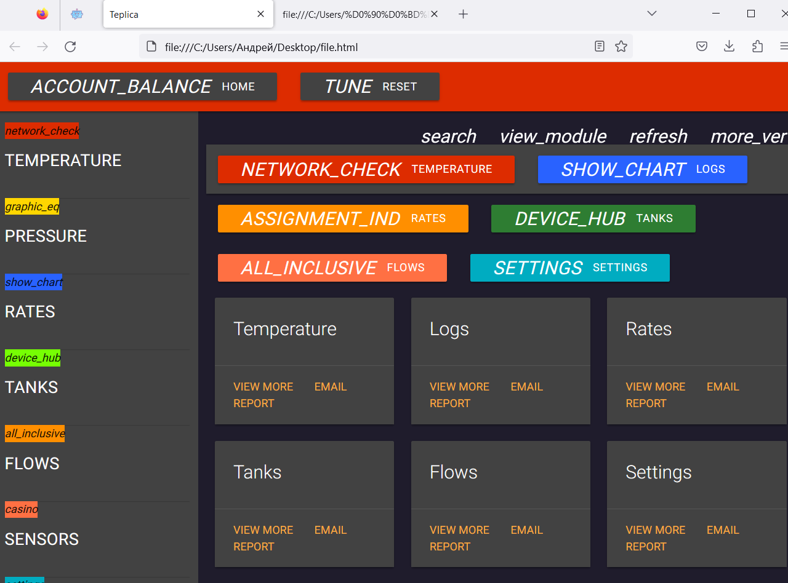

Программирование веб страницы на html
=====================================

На данный момент мы переходим к тематике программирование веб страницы на html, выводящей в окно браузера показатели датчиков, подключённых к плате ESP-JS-AR.

Практическая реализация:
------------------------

Программирование страницы HTML для вывода информации с датчиков, подключаемых к плате ESP-JS-AR, включает несколько шагов. 

Основные этапы этого процесса:
~~~~~~~~~~~~~~~~~~~~~~~~~~~~~~

Подключение датчиков к ESP-JS-AR: Сначала вам нужно подключить датчики к плате ESP-JS-AR. ESP-JS-AR обладает различными интерфейсами, такими как GPIO, I2C, SPI и другие, которые могут использоваться для подключения различных типов датчиков. Нам понадобятся соответствующие библиотеки и драйверы для работы с конкретными датчиками.

  ::

    // Подключаем библиотеки
    #include <WiFi.h>
    #include <AsyncTCP.h>
    #include <JsAr.h>
    #else
    #include <WiFi.h>
    #include <ESPAsyncTCP.h>
    #endif

Настройка веб-сервера на ESP-JS-AR: Для создания веб-страницы нам нужно настроить веб-сервер на плате ESP-JS-AR. Мы можем использовать библиотеку ESPAsyncWebServer или другую подходящую библиотеку для создания веб-сервера. Нам нужно будет настроить маршруты (routes) и обработчики запросов для отображения страницы и обработки данных датчиков.

  ::

    #include <ESPAsyncWebServer.h>

Создание HTML-шаблона: Следующий шаг - создание HTML-шаблона для страницы, на которой будет отображаться информация с датчиков. Мы можем использовать HTML, CSS и JavaScript для создания интерактивной страницы. В шаблоне мы можем определить различные элементы, такие как заголовки, таблицы, графики или другие элементы, которые отображают информацию с датчиков.

Интеграция с датчиками: В HTML-шаблоне мы можем использовать JavaScript для взаимодействия с платой ESP-JS-AR и получения данных с подключенных датчиков. Мы можем использовать AJAX-запросы или WebSocket для обновления информации на странице в реальном времени.

Отправка данных на страницу: В обработчиках запросов на сервере ESP-JS-AR мы можем получать данные с датчиков и передавать их в HTML-шаблон для отображения. Мы можем использовать шаблонизаторы, такие как Mustache или Handlebars, для динамического вставления данных в HTML-шаблон.

Развертывание и мониторинг: После завершения разработки мы можем развернуть свою веб-страницу на ESP-JS-AR и начать мониторить данные с датчиков через браузер. Мы можем использовать инструменты мониторинга, такие как Serial Monitor или MQTT, для отслеживания данных с датчиков и их удаленного управления.

Это общий процесс программирования страницы HTML для вывода информации с датчиков на плате ESP-JS-AR.

Рассмотрим пример реализации вышеописанного в коде.

Для замены заполнителя замены на кнопку в веб-странице напишем функцию:

  ::

    String processor(const String& var){
      //Serial.println(var);
      if(var == "BUTTONPLACEHOLDER"){
        String buttons ="";
        //String outputStateValue = outputState();
        i++;
        //buttons+= "<h4>Включить/выключить свет: </h4><label class=\"switch\"><input type=\"checkbox\" onchange=\"toggleCheckbox(this)\" id=\"output\" " + outputStateValue + "></label>" + "  Температура: "+ getTemp() + "  Влажность: " +getHum();
        //return buttons;
        return String();
      }
    return String();
    }

Напишем функцию для считывания и вывода данных о влажности с датчика влажности на веб-страницу.
~~~~~~~~~~~~~~~~~~~~~~~~~~~~~~~~~~~~~~~~~~~~~~~~~~~~~~~~~~~~~~~~~~~~~~~~~~~~~~~~~~~~~~~~~~~~~~~
  ::

    String getHum(){
      deviceHumTemp.ping(); // Пингуем и считываем данные влажности из конкретного регистра.
      //deviceHumTemp.read((uint8_t)24, data_humidity_int);
      return String(data_humidity_int); // Выводим данные о влажности в сериал порт.
    }

Напишем функцию для считывания и вывода данных о температуре с термометра на веб-страницу.
~~~~~~~~~~~~~~~~~~~~~~~~~~~~~~~~~~~~~~~~~~~~~~~~~~~~~~~~~~~~~~~~~~~~~~~~~~~~~~~~~~~~~~~~~~

  ::

    String getTemp(){
      //deviceHumTemp.ping();
      //deviceHumTemp.read((uint8_t)28, data_temp_temp_int);
      return String(data_temp_temp_int); // Выводим данные о температуре в сериал порт.
    }

Реализуем вывод
~~~~~~~~~~~~~~~

  ::

    String outputState() {
        if (digitalRead(output)) {
            return "checked";
        }
        else {
            return "";
        }
        return "";
    }

    void setup() {
        JsAr.begin(); // Начало работы с платой ESP.
    #endif

        // DxlMaster.begin(baudrate); // Начало работы с DXL-устройствами.
        // RGB1.init(); // Инициализация светодиода №1
        // RGB2.init(); // Инициализация светодиода №2
        // RGB3.init(); // Инициализация светодиода №3
        // deviceHumTemp.init(); // Инициализация датчика температуры и влажности.

        // Запускаем монитор порта
        Serial.begin(115200);
        pinMode(output, OUTPUT);
        digitalWrite(output, LOW);
        pinMode(buttonPin, INPUT);

        // Подключаемся к Wi-Fi
        WiFi.begin(ssid, password);
        while (WiFi.status() != WL_CONNECTED) {
            delay(1000);
            Serial.println("Connecting to WiFi..");
        }

        // Выводим IP адрес платы
        Serial.println(WiFi.localIP());

        // Маршрут для стартовой веб-страницы
        server.on("/", HTTP_GET,  {
            request->send_P(200, "text/html", index_html, processor);
        });

        // Отправляем запрос GET <ESP_IP>/update?state=<inputMessage>
        server.on("/update", HTTP_GET, [] (AsyncWebServerRequest *request) {
            String inputMessage;
            String inputParam;

            // получаем значение input1 <ESP_IP>/update?state=<inputMessage>
            if (request->hasParam(PARAM_INPUT_1)) {
                inputMessage = request->getParam(PARAM_INPUT_1)->value();
                inputParam = PARAM_INPUT_1;
                digitalWrite(output, inputMessage.toInt());
                ledState = !ledState;
            }
            else {
                inputMessage = "No message sent";
                inputParam = "none";
            }

            Serial.println(inputMessage);
            request->send(200, "text/plain", "OK");
        });

        // Отправляем запрос GET на <ESP_IP>/state
        server.on("/state", HTTP_GET, [] (AsyncWebServerRequest *request) {
            request->send(200, "text/plain", String(digitalRead(output)).c_str());
        });

        // Запускаем сервер
        server.begin();
    }

    void loop() {
        // считываем состояние переключателя в локальную переменную:
        int reading = digitalRead(buttonPin);

        // подождите немного и проверьте не изменился ли сигнал
        // (с LOW на HIGH) с момента последнего нажатия чтобы исключить дребезг:
        // Если состояние изменилось из-за дребезга или случайного нажатия:
        if (reading != lastButtonState) {
            // сбрасываем таймер
            lastDebounceTime = millis();
        }

        if ((millis() - lastDebounceTime) > debounceDelay) {
            // вне зависимости от действительного состояния,
            // если оно длится больше задержки, то принимаем его за текущее:
            // если состояние кнопки изменилось:
            if (reading != buttonState) {
                buttonState = reading;
                // включаем светодиод только если сигнал HIGH
                if (buttonState == HIGH) {
                    ledState = !ledState;
                }
            }
        }

        // выводим состояние светодиода:
        // digitalWrite(output, ledState);

        if (ledState) {
            // RGB1.write(26, 0);
            // RGB1.write(27, 0);
            // RGB1.write(28, 0);
        }
        else {
            // RGB1.write(26, 255);
            // RGB1.write(27, 255);
            // RGB1.write(28, 255);
        }
    }

Результат работы программы.
~~~~~~~~~~~~~~~~~~~~~~~~~~~

.. raw:: html

    

        <iframe src="https://www.youtube.com/embed/npcysg6_Rks?si=zEU6N0ZHy4XZu62E" frameborder="0" allowfullscreen style="position: absolute; top: 0; left: 0; width: 100%; height: 100%;"></iframe>
    

