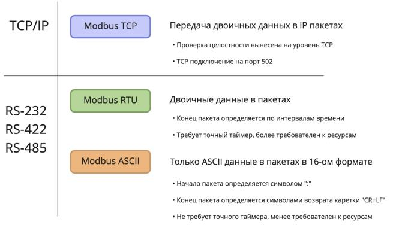
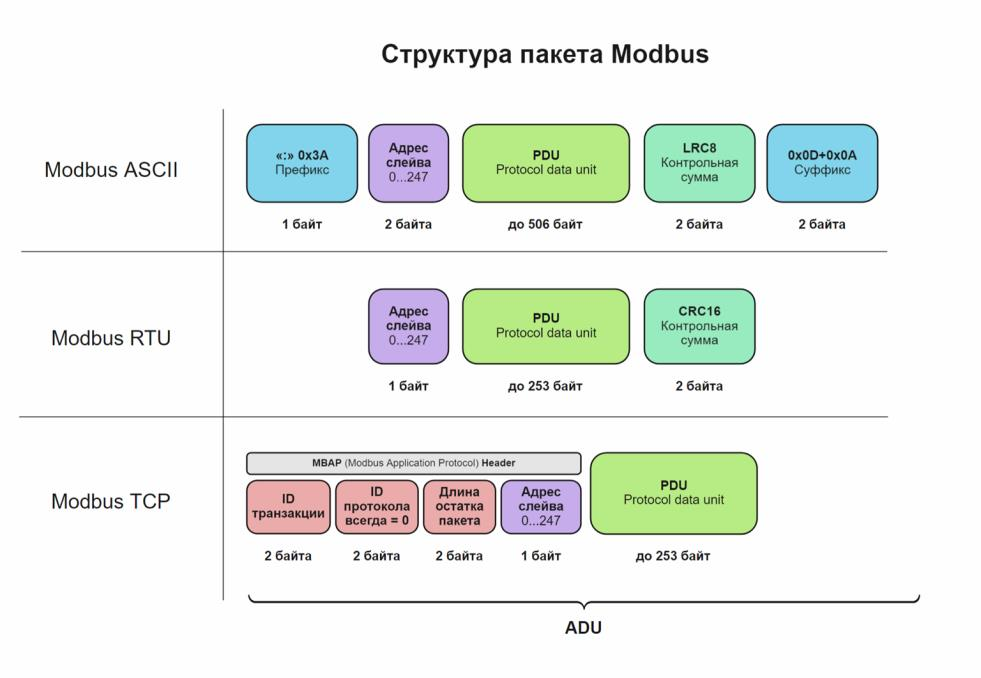

Протокол Modbus — самый распространенный промышленный протокол для M2M-взаимодействия. Является стандартом де-факто и поддерживается почти всеми производителями промышленного оборудования.

.. raw:: html

    

        <iframe src="https://www.youtube.com/embed/n7QDSoBuXD4?si=zktVqc_088sTk2SM" frameborder="0" allowfullscreen style="position: absolute; top: 0; left: 0; width: 100%; height: 100%;"></iframe>
    

Благодаря универсальности и открытости, стандарт позволяет интегрировать оборудование разных производителей. Modbus используется для сбора показания с датчиков, управления реле и контроллерами, мониторинга, и т.д.

Обзор протокола
---------------

История Modbus
~~~~~~~~~~~~~~

Modbus был представлен в 1979 году компанией Modicon (ныне Schneider Electric). Это был открытый стандарт, работающий по интерфейсу RS-232. Позже появилась реализации протокола для интерфейсов RS-485 и Modbus TCP. Протокол быстро набрал популярность, и многие производители стали внедрять его в своих устройствах.

Позже права на протокол были переданы некоммерческой организации Modbus Organization, которая до сегодняшнего дня владеет стандартом.

В описании стандарта Modbus используются терминология, унаследованная от языков релейной логики. Так, например, некоторые регистры называются катушками (англ. coil).

Физический уровень
~~~~~~~~~~~~~~~~~~

Протокол MODBUS TCP работает на физическом уровне с использованием стека протоколов TCP/IP. Это означает, что он использует стандартный ``Ethernet-кабель`` для подключения к сети и использует протокол ``TCP/IP`` для передачи данных.

MODBUS TCP работает по принципу ``клиент-серверной архитектуры``, где клиентское устройство (например, компьютер или контроллер) и серверное устройство (например, датчик или привод) общаются друг с другом посредством определенных сообщений, отправляемых через сеть.

Логический уровень
~~~~~~~~~~~~~~~~~~

Протокол MODBUS TCP работает на логическом уровне с использованием клиент-серверной модели передачи данных. Это означает, что клиентское устройство (например, компьютер или контроллер) отправляет запрос на серверное устройство (например, датчик или привод), который затем обрабатывает запрос и отправляет ответ обратно клиенту.

На логическом уровне, протокол MODBUS TCP использует различные функции для чтения и записи данных. Каждая функция имеет свой уникальный код, который определяет тип операции, которую необходимо выполнить. Например, функция ``чтения регистров`` имеет код 03, а функция ``записи регистров`` имеет код 06.

Формат пакета
~~~~~~~~~~~~~

Недостатки протокола Modbus
~~~~~~~~~~~~~~~~~~~~~~~~~~~

Справедливости ради, стоит упомянуть и о недостатках протокола. Так как он разрабатывался более 40 лет назад, когда производительность процессоров была существенно ниже и протоколы разрабатывались без учета защиты данных, он имеет рад минусов:

Протокол не предусматривает аутентификацию и шифрование передаваемых данных. Поэтому, при использовании Modbus TCP необходимо использовать дополнительные VPN-тоннели.

- Slave-устройство не может инициировать передачу данных, поэтому master должен постоянно опрашивать ведомые устройства

- Slave-устройство не может обнаружить потерю связи с Master. Эта проблема напрямую следует из предыдущей.

Однако, несмотря на все недостатки, Modbus по-прежнему остается самым распространенным промышленным протоколом, и благодаря открытости, позволяет легко объединять устройства разных производителей. Нетребовательность к ресурсам позволяет интегрировать протокол в самые маломощные устройства.

Все устройства Modbus взаимодействуют, следуя модели ``master-slave``. Запросы может инициировать только master-устройство, ``slave-устройства`` могут только отвечать на запросы, и не могут самостоятельно начинать передачу данных. В зависимости от реализации протокола, заголовки пакета различаются. Вот основные составляющие пакета, которые важно знать:

1. ``ADU`` (Application Data Unit) — пакет Modbus целиком, со всеми заголовками, PDU, контрольной суммой, адресом и маркерами. Отличается, в зависимости от реализации протокола.

2. ``PDU`` (protocol data unit) — основная часть пакета, одинаковая для всех реализаций протокола. Содержит сам payload.

.. raw:: html

    

        <iframe src="https://www.youtube.com/embed/hcBlDbrAozM?si=I4pe-B7GOxUZdclh" frameborder="0" allowfullscreen style="position: absolute; top: 0; left: 0; width: 100%; height: 100%;"></iframe>
    

