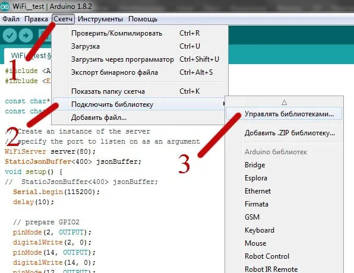

Вывод данных с датчиков Agrolab GH по протоколу MODBUS TCP
-------------------------------------------------------

Программное обеспечение для вывода данных
~~~~~~~~~~~~~~~~~~~~~~~~~~~~~~~~~~~~~~~~~

Для вывода данных с датчиков, установленных в умной Agrolab GH, на локальный сервер и управления подвижными элементами Agrolab GH, используется установленное на персональном компьютере программное обеспечение Node-RED, предоставляющее удобный интерфейс для построения логических связей между данными, получаемыми от датчиков в реальном времени, и Agrolab GH

**Установка библиотеки ModbusServerWiFi**

Библиотеку ModbusServerWiFi можно найти и загрузить из Arduino IDE, используя менеджер библиотек. Это делается через меню "Инструменты" -> "Управление библиотеками".

       

**Создание Modbus сервера на ESP32**

1. Подключение необходимых библиотек
::

    #include <ModbusServerWiFi.h> - включает модуль для работы с Modbus сервером на ESP32 через Wi-Fi.
    #include <WiFi.h> - включает модуль для подключения ESP32 к Wi-Fi сети.

2. Определение параметров Wi-Fi
::

    const char* ssid = "Ваш_SSID"; - SSID вашей Wi-Fi сети.
    const char* password = "Ваш_пароль"; - пароль Wi-Fi сети.

3. Создание экземпляра сервера Modbus
::

    ModbusServerWiFi modbusServer; - объявляет переменную modbusServer типа ModbusServerWiFi для создания Modbus сервера.

4. Функция setup():

a. Инициализация и подключение к Wi-Fi сети.
b. Инициализация и настройка сервера Modbus с портом 502 (стандартный порт Modbus).
c. Добавление регистров хранения Modbus (по умолчанию нет добавленных регистров, и пользователь может добавить их самостоятельно).

5. Функция loop():

a. Обработка запросов Modbus клиентов: modbusServer.poll();
b. В этой части кода пользователь может добавить свой код для обработки данных или событий, связанных с его проектом.

Этот код предоставляет основу для создания Modbus сервера на ESP32::

    #include <ModbusServerWiFi.h>
    #include <WiFi.h>

    // Параметры Wi-Fi
    const char* ssid = "Ваш_SSID";
    const char* password = "Ваш_пароль";

    // Создаем экземпляр сервера Modbus
    ModbusServerWiFi modbusServer;

    void setup() {
    // Инициализация Wi-Fi
    WiFi.begin(ssid, password);
    while (WiFi.status() != WL_CONNECTED) {
        delay(1000);
        Serial.println("Подключение к Wi-Fi...");
    }
    Serial.println("Подключено к Wi-Fi");

    // Настройка Modbus сервера
    modbusServer.begin(502); // Порт Modbus (стандартный - 502)

    // Добавление регистров Modbus
    // Здесь можно добавить свои регистры
    // Например:
    // modbusServer.addHoldingRegister(0, 0); // Добавление регистра хранения

    Serial.println("Modbus сервер запущен");
    }

    void loop() {
    // Обработка запросов Modbus
    modbusServer.poll();

    // Добавьте свой код здесь для обработки данных или событий
    }    

