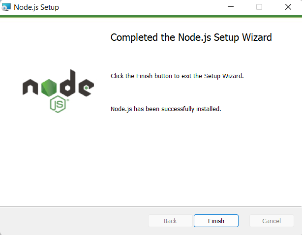
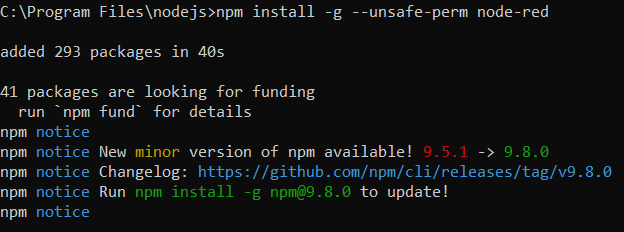
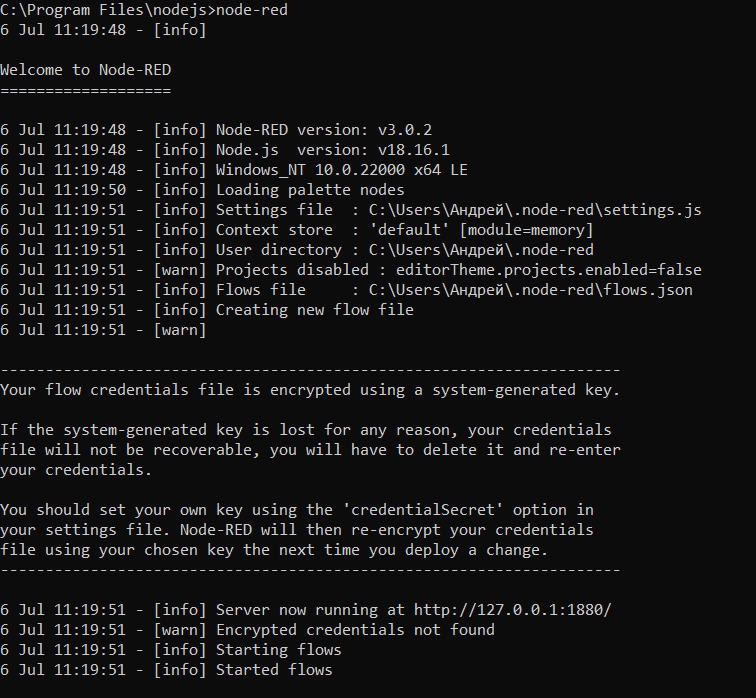

Установка
---------

1. Для установки Node-RED перейдём на официальный сайт продукта: ``https://nodered.org/``

2. На открывшейся странице нажмём на кнопку “Get Started”

3. Выберем вариант “Run locally” , “Getting started”

4. В открывшейся странице выберем вариант “Running locally” чтобы установить Node-RED на свой ПК

5. Выберем вариант установки для Windows или для любой другой операционной системы

Далее, следуя указаниям в инструкции по установке перейдите на страницу ``https://nodejs.org/en`` и скачайте .msi файл. После успешной установки вы увидите следующее сообщение. Кроме того, откроется консоль установки дополнительных инструментов Node.js

Откройте cmd, перейдите в каталог nodejs. Запустите процесс установки Node-RED. Для
этого введите следующий запрос::

  npm install -g --unsafe-perm node-red

Для запуска Node-RED введите команду:: 

  node-red

.. raw:: html

    

        <iframe src="https://www.youtube.com/embed/z9AyxHK7v70?si=Zdu1fHoZcLANLn6T" frameborder="0" allowfullscreen style="position: absolute; top: 0; left: 0; width: 100%; height: 100%;"></iframe>
    

