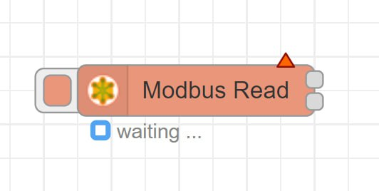
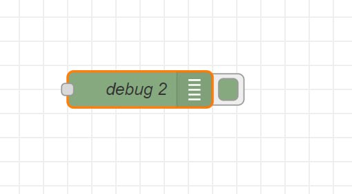

Изучение интерфейса Node-RED
----------------------------

Node-Red - это инструмент, который позволяет вам легко создавать программы, используя блоки визуального программирования. Тут мы изучим интерфейс Node-Red

Начало работы
~~~~~~~~~~~~~

После установки Node-Red вам будет доступен веб-интерфейс, который вы можете открыть в вашем браузере, перейдя по адресу `http://localhost:1880 <http://localhost:1880>`_. При первом запуске Node-Red вас встретит стартовый экран, на котором вы сможете начать создавать свою первую программу.

Область работы
~~~~~~~~~~~~~~

Область работы находится в центре интерфейса и представляет собой пустой лист бумаги, на котором вы можете размещать узлы и соединения между ними. Щелкните правой кнопкой мыши на листе бумаги, чтобы открыть контекстное меню и добавить новый узел или создать новое соединение.

Палитра узлов
~~~~~~~~~~~~~

Палитра узлов находится слева от области работы и содержит все доступные узлы, которые вы можете использовать в своей программе. Наведите курсор на узел, чтобы увидеть, как он выглядит, и щелкните по нему, чтобы добавить его на область работы.

Панель свойств
~~~~~~~~~~~~~~

Панель свойств находится в правой части интерфейса и позволяет вам настраивать свойства узлов, которые вы размещаете на области работы. Щелкните по узлу, чтобы открыть панель свойств и настроить его параметры.

       
Описание узлов которые будут использованы
~~~~~~~~~~~~~~~~~~~~~~~~~~~~~~~~~~~~~~~~~

1. Modbus-Write

Узел Modbus TCP/Serial запускается с помощью msg.payload для записи.

Соединяется с сервером Modbus TCP или последовательным для записи катушек/регистров при каждом входящем сообщении.

В настоящее время поддерживаются следующие коды функций:
- FC 5: Принудительная запись одной катушки

- FC 6: Установка одного регистра

- FC 15: Принудительная запись нескольких катушек

- FC 16: Установка нескольких регистров

Выберите код функции (FC) из выпадающего списка, выберите стартовый адрес катушки/регистра (0:65535) и количество записей. Выберите или отредактируйте конфигурацию сервера Modbus TCP/serial, указав сервер для подключения.

Unit-Id (0..255 tcp | 0..247 serial) - оставьте пустым, в противном случае он переопределит значение Unit-ID по умолчанию в клиентской конфигурации

Для FC 5 значение msg.payload должно быть 1 или 0 или true или false. Для FC 15 значение msg.payload должно быть массивом[] из разделенных запятыми значений true или false каждый. Для FC 6 значение msg.payload должно быть одним числом в диапазоне 0:65535. Для FC 16 значение msg.payload должно быть массивом[] из разделенных запятыми числовых значений в диапазоне 0:65535 каждый.

Выход 1: все предоставленные данные, модбас ответ в виде буфера, входящее сообщение

Выход 2: модбас ответ в виде буфера, все предоставленные данные, входящее сообщение

2. Modbus-Read

Подключается к Modbus TCP или последовательному интерфейсу для чтения значений регистров/катушек с заданной частотой опроса.

Поддерживаемые функциональные коды включают следующие:

- FC 1: Чтение статуса катушки

- FC 2: Чтение статуса входа

- FC 3: Чтение удерживающих регистров

- FC 4: Чтение регистров ввода

Выберите функциональный код (FC) из выпадающего меню, выберите начальный адрес катушки/входа/регистра (0:65535) и количество катушек/входов/регистров для чтения, начиная с начального адреса.

Unit-ID (0..255 TCP | 0..247 последовательный) - оставьте пустым, в противном случае он переопределит значения по умолчанию Unit-ID, указанные в конфигурации клиента.

Установите интервал опроса (больше нуля) и временную единицу. Выберите или измените конфигурацию подключения Modbus.

Выход 1: массив данных (PDU), буфер ответа Modbus, входящее сообщение.

Выход 2: буфер ответа Modbus, массив данных (PDU), входящее сообщение.

3. Gauge (шкала)

Добавляет виджет типа датчик в пользовательский интерфейс.

В msg.payload ищется числовое значение и форматируется в соответствии с определенным форматом значения, который затем можно отформатировать с помощью фильтров Angular.

Например: {{value | number:1}}% округлит значение до одного десятичного знака и добавит знак %.

Можно указать цвета каждого из 3 секторов, и датчик будет смешивать их между собой. Цвета должны быть указаны в формате hex (#rrggbb).

Если вы указываете числа для секторов, то цвета будут меняться для каждого сектора. Если не указано, то цвета будут смешиваться на всем диапазоне.

Датчик имеет несколько режимов: обычный, пончик, компас и волна.

Метку также можно установить с помощью свойства сообщения, задав поле в виде имени свойства, например, {{msg.topic}}.

Если указан Класс, он будет добавлен к родительской карте. Таким образом, вы можете стилизовать карту и элементы внутри нее с помощью пользовательских стилей CSS. Класс можно установить во время выполнения, задав строковое свойство msg.className.

4. Switch (переключатель Вкл. /Выкл. )

Добавляет переключатель в пользовательский интерфейс.

Каждое изменение состояния переключателя будет генерировать msg.payload с указанными значениями Вкл и Выкл.

Цвет и значок Вкл/Выкл являются необязательными полями. Если они все указаны, стандартный тумблер заменяется на соответствующие значки и их соответствующие цвета.

Поле значка Вкл/Выкл может быть значком Material Design (например, 'check', 'close'), значком Font Awesome (например, 'fa-fire') или значком погоды. Вы можете использовать полный набор значков Google Material, добавив 'mi-' к имени значка, например 'mi-videogame_asset'.

В режиме пропускания состояние переключателя может быть обновлено входящим msg.payload с указанными значениями, которые также должны соответствовать указанному типу (число, строка и т.д.). Если не используется режим пропуска, значок может отслеживать состояние выхода или входного msg.payload, чтобы обеспечить обратную связь замкнутого контура.

Метка также может быть задана свойством сообщения, установив поле в имя свойства, например, {{msg.topic}}.

Если указана тема, она будет добавлена к выводу как msg.topic.

Установка msg.enabled в значение false отключает виджет переключателя.

Если указан класс, он будет добавлен в родительскую карту. Таким образом, вы можете стилизовать карту и элементы внутри него с помощью пользовательского CSS. Класс может быть установлен во время выполнения, установив свойство строки msg.className.

5. Debug

Отображает выбранные свойства получаемых узлом сообщения на боковой панели во вкладке отладки и, при необходимости, журнале среды выполнения. По умолчанию отображается содержимое msg.payload, но узел можно настроить на отображение любого свойства, всех свойств сообщения или результата выражения JSONata.

Вкладка отладки на боковой панели обеспечивает структурированное представление полученных узлом сообщений, что упрощает исследование их структуры.

Объекты и массивы JavaScript могут быть свернуты и развернуты по мере необходимости. Буферы могут отображаться в виде данных как есть или в виде строки, когда это возможно.

Рядом с каждым сообщением отладочная панель показывает информацию о времени получения сообщения, узле, который его отправил, и типе данных. Нажатие на идентификатор узла-источника покажет этот узел в рабочей области.

Кнопка на узле может использоваться для включения или отключения вывода информации о получаемых сообщениях. Рекомендуется отключать или удалять любые отладочные узлы, которые не используются.

Узел также может быть настроен на отправку всех сообщений в журнал выполнения или отправку короткого (32 символа) текста в статус под узлом.

.. raw:: html

    

        <iframe src="https://www.youtube.com/embed/P9Rwk04HiZA?si=gAs3zuLeYq6_hVIe" frameborder="0" allowfullscreen style="position: absolute; top: 0; left: 0; width: 100%; height: 100%;"></iframe>
    

