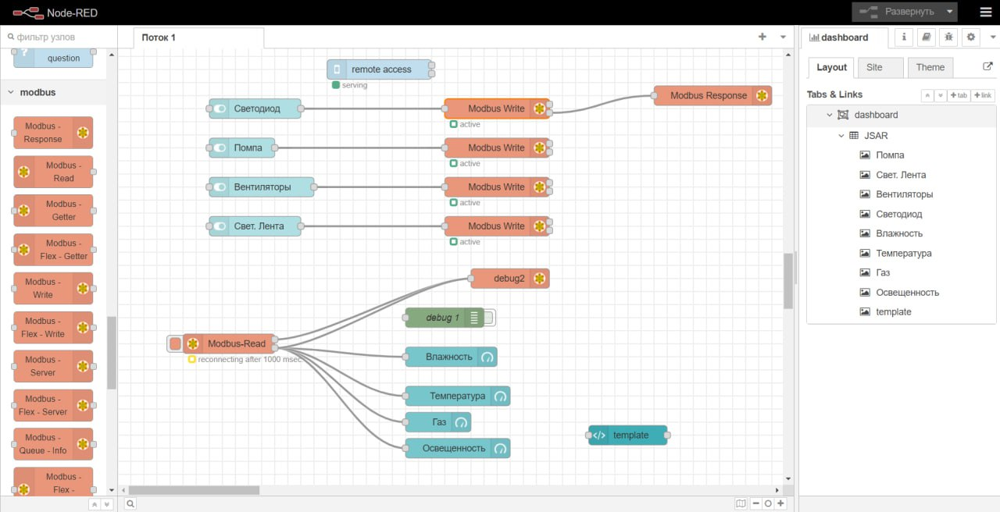
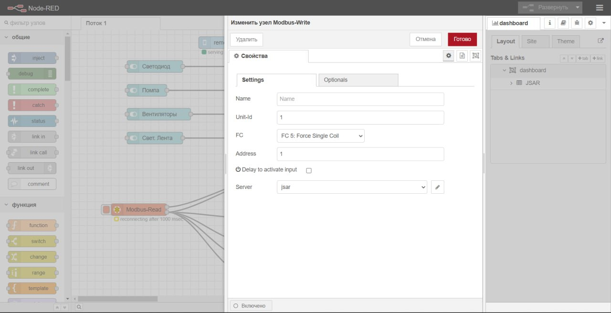
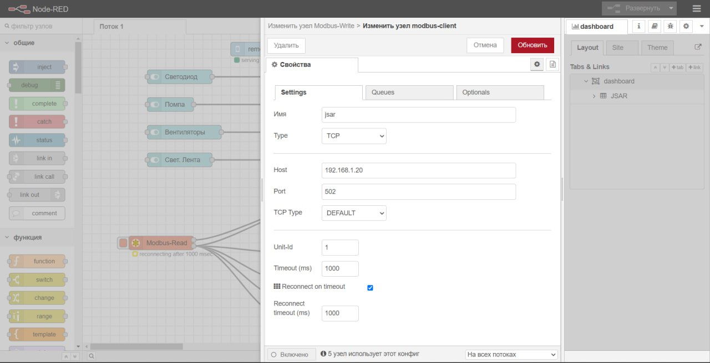
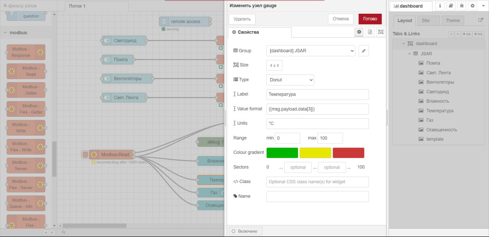
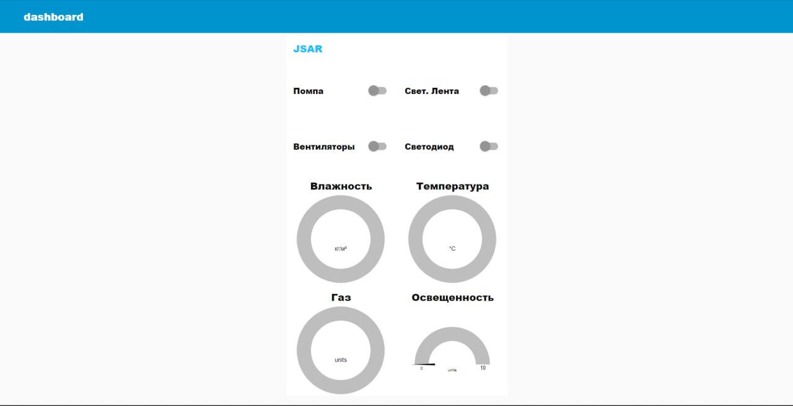

Настройка параметров подключения узла
~~~~~~~~~~~~~~~~~~~~~~~~~~~~~~~~~~~~~

Настройка параметров подключения для узла Modbus в Node-RED может немного отличаться в зависимости от узла, который вы используете. Однако, общие шаги по настройке параметров подключения для узла Modbus включают следующее:

1. Откройте Node-RED и перетащите узел Modbus на рабочее пространство.

2. Настройте имя узла на ваше усмотрение, чтобы легко идентифицировать узел Modbus в вашем потоке.

3. Введите IP-адрес сервера, с которым вы хотите связаться, в поле ``IP Address``.

4. Введите номер порта, используемого для связи с сервером, в поле ``Port``.

5. Выберите тип устройства, с которым вы хотите связаться, в поле ``Unit ID``. Это может быть, например, контроллер, датчик, привод или другое устройство.

6. Выберите функцию Modbus, необходимую для вашей конкретной задачи, в поле ``Function Code``. Например, это может быть функция чтения регистра ``(Read Holding Register)``, записи в регистр ``(Write Holding Register)`` или другая функция.

7. Если требуется, введите адрес регистра или другие параметры, связанные с выбранной функцией, в соответствующие поля.

8. Сохраните настройки узла Modbus и подключите его проводами (wires) к другим узлам, чтобы передавать сообщения и данные между ними. Обратите внимание, что параметры подключения для узла Modbus в Node-RED могут различаться в зависимости от узла, который вы используете, и от типа устройства, с которым вы хотите связаться.

9. Результат работы можно увидеть перейдя во вкладку Dashboard, или по ссылке ``http://localhost:1880/ui``

